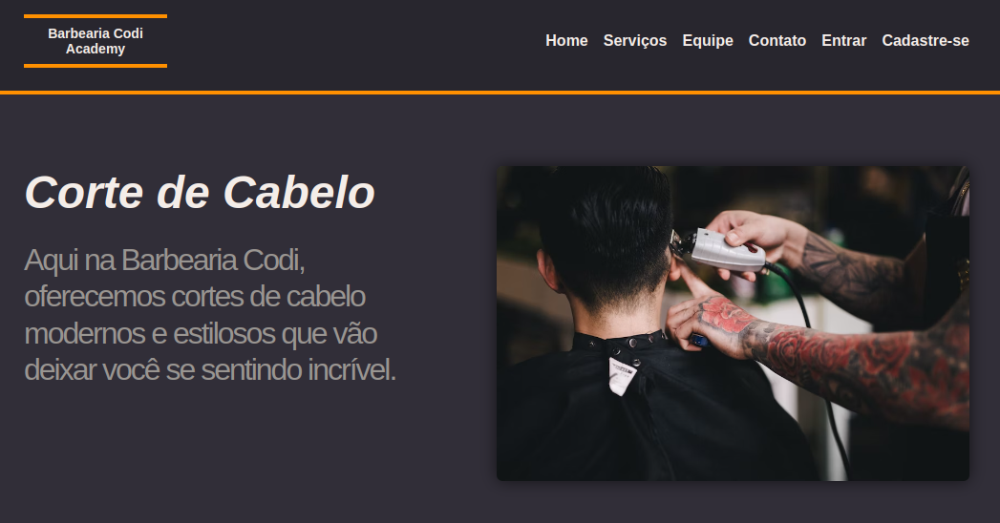

<h2 align="center">Challenge FullStack 1° Edição</h2>
<br>

<p align="center">
     <a href="#-tecnologias">Tecnologias</a> •
     <a href="#-features">Tecnologias</a> • 
     <a href="#-como-usar">Como usar</a> • 
     <a href="#-colaboradores">Colaboradores</a> •
     <a href="#-licença">Licença</a> 
</p>

<br>
Este é um projeto de uma agenda de barbearia desenvolvido em HTML, CSS e PHP.


<br>

# 🌄 Layout



<br>

# ✅ Features

- Sistema de login
- Os clientes podem agendar cortes de cabelo e outros serviços oferecidos pela barbearia.
- Os agendamentos são armazenados em um banco de dados.
- Os clientes podem visualizar os horários disponíveis e selecionar o horário desejado.


<br>

# 🛠 Tecnologias

Abaixo tecnologias que foram usadas no projeto

- PHP
- JavaScript
- HTML
- CSS
- MySQL

<br>

# 💿 Como usar

## ✅ Pré-requisitos


## 🎬 Rodando projeto

```bash
# Clone este repositório
git clone https://github.com/GustRib/Challenge-Codi-Noite.git

# Acesse a pasta do projeto
cd Challenge-Codi-Noite

# Rodando a aplicação
Você precisa baixar o WAMPSERVER ou similar para rodar a aplicação no localhost

```

<br>

# 👨‍💻 Colaboradores

<table>
<tr>
        <td align="center"><a href="https://github.com/fernandolimma"><br /><sub><b>Fernando Lima</b></sub></a><br /><a href="https://brunogoncalvesferreira.com" title="Fernando Lima">👨‍🚀</a></td>
    </tr>
        <tr>
        <td align="center"><a href="https://brunogoncalvesferreira.com"><br /><sub><b>Bruno Gonçalves</b></sub></a><br /><a href="https://brunogoncalvesferreira.com" title="Bruno Gonçalves Ferreira">👨‍🚀</a></td>
    </tr>
    <tr>
        <td align="center"><a href="https://github.com/leandrovrb"><br /><sub><b>leandrovrb</b></sub></a><br /><a href="" title="leandrovrb">👨‍🚀</a></td>
    </tr>
    <tr>
        <td align="center"><a href="https://github.com/Isaacguedess"><br /><sub><b>Isaacguedess</b></sub></a><br /><a href="" title="">👨‍🚀</a></td>
    </tr>
    <tr>
        <td align="center"><a href="https://github.com/PatricioSA"><br /><sub><b>Patrício Samuel</b></sub></a><br /><a href="" title="">👨‍🚀</a></td>
    </tr>
    <tr>
        <td align="center"><a href="https://github.com/vinicius-oliveiracr"><br /><sub><b>Vinicius Oliveira
</b></sub></a><br /><a href="" title="">👨‍🚀</a></td>
    </tr>
    <tr>
        <td align="center"><a href="https://github.com/Paulo-GranadeiroYi"><br /><sub><b>Paulo-GranadeiroYi

</b></sub></a><br /><a href="" title="">👨‍🚀</a></td>
    </tr>
</table>

<br>

## ✅ Licença

[MIT](https://choosealicense.com/licenses/mit/)
